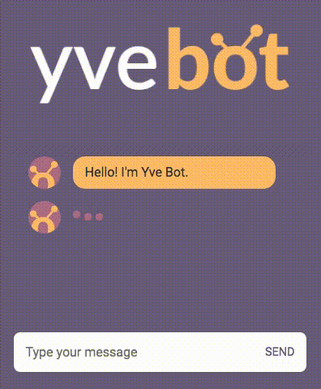
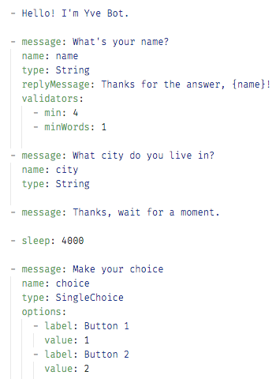
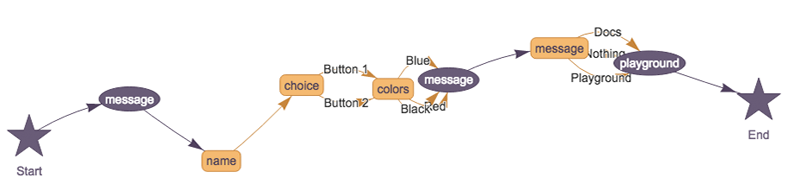

# yve-bot  

The simplest way to build a smart and customized rule-based bot conversation. For Browser & Node environment.

 

[Live demo](https://andersonba.github.io/yve-bot) / [Playground](https://andersonba.github.io/yve-bot/docs/playground)

[Documentation](https://andersonba.github.io/yve-bot/docs)

Code examples: [Yaml](examples/chat.yaml) - [CLI](examples/cli) - [Browser](examples/web) - [Node/Socket.io](examples/socket.io)
